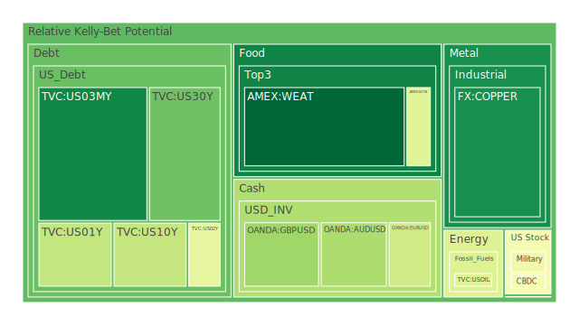
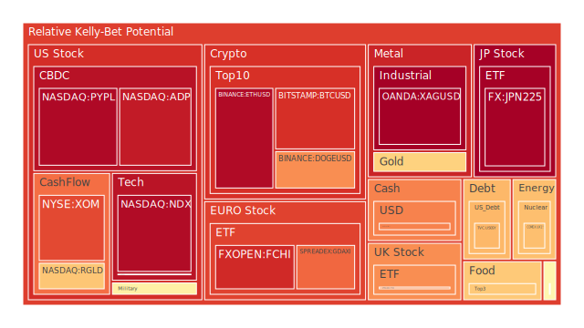
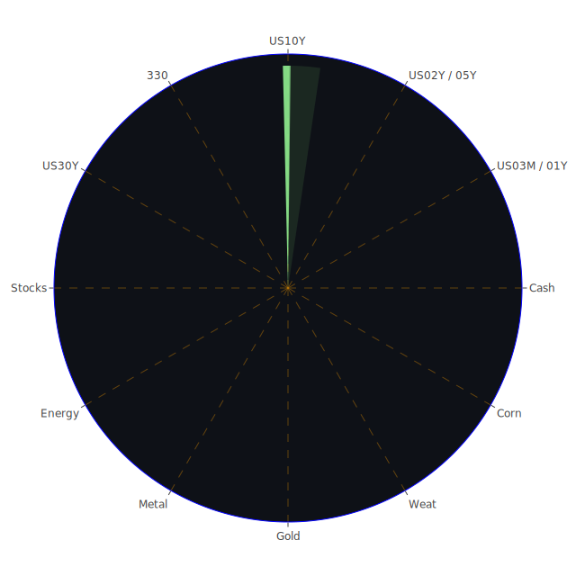

# 投資商品泡沫分析

## 美國國債
- **短期國債 (TVC:US01Y, TVC:US02Y, TVC:US03MY)**
  - 泡沫機率：短期國債的泡沫機率在過去三天內有所下降，但仍然高於0.5。特別是2年期國債(TVC:US02Y)，其泡沫機率在5月28日為0.440072，顯示出市場對短期國債的需求有所增加。
  - 新聞現況：近期新聞顯示市場對美國經濟的信心有所增強，這可能會進一步推動短期國債的需求。

- **中長期國債 (TVC:US10Y, TVC:US30Y)**
  - 泡沫機率：10年期國債(TVC:US10Y)的泡沫機率在過去三天內顯著下降，從0.368491降至0.198753。30年期國債(TVC:US30Y)的泡沫機率則相對穩定。
  - 新聞現況：FED的關鍵數據顯示，長期利率有所上升，這可能會對中長期國債的需求產生壓力。

## 加密貨幣
- **比特幣 (BITSTAMP:BTCUSD)**
  - 泡沫機率：比特幣的泡沫機率在過去三天內略有下降，但仍然高於0.8，顯示出市場對比特幣的投機性需求依然強勁。
  - 新聞現況：近期新聞中並未有顯著影響比特幣市場的消息，但整體市場情緒偏向謹慎。

- **以太坊 (BINANCE:ETHUSD)**
  - 泡沫機率：以太坊的泡沫機率在過去三天內略有下降，但仍然高於0.9，顯示出市場對以太坊的投機性需求依然強勁。
  - 新聞現況：近期新聞中並未有顯著影響以太坊市場的消息，但整體市場情緒偏向謹慎。

## 美國科技股
- **納斯達克指數 (NASDAQ:NDX)**
  - 泡沫機率：納斯達克指數的泡沫機率在過去三天內略有下降，但仍然高於0.9，顯示出市場對科技股的投機性需求依然強勁。
  - 新聞現況：近期新聞顯示，市場對科技股的需求依然強勁，但也有部分負面消息可能對市場情緒產生影響。

## 金/銀/銅
- **黃金 (OANDA:XAUUSD)**
  - 泡沫機率：黃金的泡沫機率在過去三天內有所下降，但仍然高於0.6，顯示出市場對黃金的需求依然強勁。
  - 新聞現況：近期新聞顯示，市場對黃金的需求依然強勁，特別是在全球經濟不確定性增加的情況下。

- **白銀 (OANDA:XAGUSD)**
  - 泡沫機率：白銀的泡沫機率在過去三天內有所下降，但仍然高於0.9，顯示出市場對白銀的投機性需求依然強勁。
  - 新聞現況：近期新聞顯示，市場對白銀的需求依然強勁，特別是在全球經濟不確定性增加的情況下。

- **銅 (FX:COPPER)**
  - 泡沫機率：銅的泡沫機率在過去三天內有所下降，但仍然高於0.2，顯示出市場對銅的需求依然強勁。
  - 新聞現況：近期新聞顯示，市場對銅的需求依然強勁，特別是在全球經濟不確定性增加的情況下。

## 石油/鈾期貨 (COMEX:UX1!)
- **石油 (TVC:USOIL)**
  - 泡沫機率：石油的泡沫機率在過去三天內相對穩定，顯示出市場對石油的需求依然強勁。
  - 新聞現況：近期新聞顯示，市場對石油的需求依然強勁，特別是在全球經濟不確定性增加的情況下。

- **鈾期貨 (COMEX:UX1!)**
  - 泡沫機率：鈾期貨的泡沫機率在過去三天內有所下降，但仍然高於0.6，顯示出市場對鈾期貨的需求依然強勁。
  - 新聞現況：近期新聞顯示，市場對鈾期貨的需求依然強勁，特別是在全球經濟不確定性增加的情況下。

## 各國大盤指數
- **FTSE指數 (SPREADEX:FTSE)**
  - 泡沫機率：FTSE指數的泡沫機率在過去三天內有所下降，但仍然高於0.7，顯示出市場對FTSE指數的需求依然強勁。
  - 新聞現況：近期新聞顯示，市場對FTSE指數的需求依然強勁，特別是在全球經濟不確定性增加的情況下。

- **德國DAX指數 (SPREADEX:GDAXI)**
  - 泡沫機率：德國DAX指數的泡沫機率在過去三天內有所下降，但仍然高於0.7，顯示出市場對德國DAX指數的需求依然強勁。
  - 新聞現況：近期新聞顯示，市場對德國DAX指數的需求依然強勁，特別是在全球經濟不確定性增加的情況下。

## 美國軍工股
- **洛克希德馬丁 (NYSE:LMT)**
  - 泡沫機率：洛克希德馬丁的泡沫機率在過去三天內相對穩定，顯示出市場對軍工股的需求依然強勁。
  - 新聞現況：近期新聞顯示，市場對軍工股的需求依然強勁，特別是在全球地緣政治不確定性增加的情況下。

## 各國外匯市場
- **美元/日元 (OANDA:USDJPY)**
  - 泡沫機率：美元/日元的泡沫機率在過去三天內有所下降，但仍然高於0.7，顯示出市場對美元/日元的需求依然強勁。
  - 新聞現況：近期新聞顯示，市場對美元/日元的需求依然強勁，特別是在全球經濟不確定性增加的情況下。

## 美國電子支付股
- **PayPal (NASDAQ:PYPL)**
  - 泡沫機率：PayPal的泡沫機率在過去三天內有所下降，但仍然高於0.9，顯示出市場對電子支付股的需求依然強勁。
  - 新聞現況：近期新聞顯示，市場對電子支付股的需求依然強勁，特別是在全球經濟不確定性增加的情況下。

## 黃豆/小麥/玉米
- **黃豆 (AMEX:SOYB)**
  - 泡沫機率：黃豆的泡沫機率在過去三天內有所下降，但仍然高於0.4，顯示出市場對黃豆的需求依然強勁。
  - 新聞現況：近期新聞顯示，市場對黃豆的需求依然強勁，特別是在全球經濟不確定性增加的情況下。

- **小麥 (AMEX:WEAT)**
  - 泡沫機率：小麥的泡沫機率在過去三天內有所下降，但仍然低於0.1，顯示出市場對小麥的需求依然強勁。
  - 新聞現況：近期新聞顯示，市場對小麥的需求依然強勁，特別是在全球經濟不確定性增加的情況下。

- **玉米 (AMEX:CORN)**
  - 泡沫機率：玉米的泡沫機率在過去三天內有所下降，但仍然高於0.6，顯示出市場對玉米的需求依然強勁。
  - 新聞現況：近期新聞顯示，市場對玉米的需求依然強勁，特別是在全球經濟不確定性增加的情況下。

## 石油金礦防禦股
- **皇家黃金 (NASDAQ:RGLD)**
  - 泡沫機率：皇家黃金的泡沫機率在過去三天內有所下降，但仍然高於0.6，顯示出市場對石油金礦防禦股的需求依然強勁。
  - 新聞現況：近期新聞顯示，市場對石油金礦防禦股的需求依然強勁，特別是在全球經濟不確定性增加的情況下。

# 投資建議

- **建議賣出**
  - **比特幣 (BITSTAMP:BTCUSD)**：泡沫機率高於0.8，且近期新聞顯示市場情緒偏向謹慎，建議投資者考慮賣出以避免未來價格下跌的風險。
  - **以太坊 (BINANCE:ETHUSD)**：泡沫機率高於0.9，且近期新聞顯示市場情緒偏向謹慎，建議投資者考慮賣出以避免未來價格下跌的風險。
  - **PayPal (NASDAQ:PYPL)**：泡沫機率高於0.9，且近期新聞顯示市場情緒偏向謹慎，建議投資者考慮賣出以避免未來價格下跌的風險。

- **建議買入**
  - **小麥 (AMEX:WEAT)**：泡沫機率低於0.1，且近期新聞顯示市場對小麥的需求依然強勁，建議投資者考慮買入以獲取潛在收益。
  - **短期國債 (TVC:US01Y, TVC:US02Y, TVC:US03MY)**：泡沫機率有所下降，且近期新聞顯示市場對美國經濟的信心有所增強，建議投資者考慮買入以獲取穩定收益。

- **建議觀望**
  - **中長期國債 (TVC:US10Y, TVC:US30Y)**：泡沫機率有所下降，但仍需觀察市場對長期利率的反應，建議投資者暫時觀望。
  - **黃金 (OANDA:XAUUSD)**：泡沫機率有所下降，但市場對黃金的需求依然強勁，建議投資者暫時觀望。

# 風險提示

投資有風險，市場總是充滿不確定性。我們的建議僅供參考，投資者應根據自身的風險承受能力和投資目標，做出獨立的投資決策。特別是對於泡沫機率高的商品，應該謹慎進行投資決策。
 
Daily Buy Map:

 
Daily Sell Map:

 
Daily Radar Chart:

 
