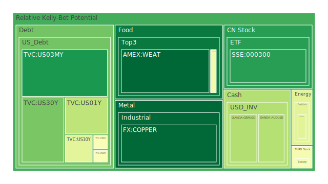
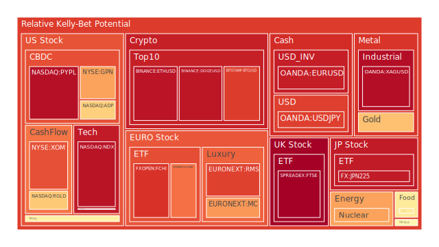
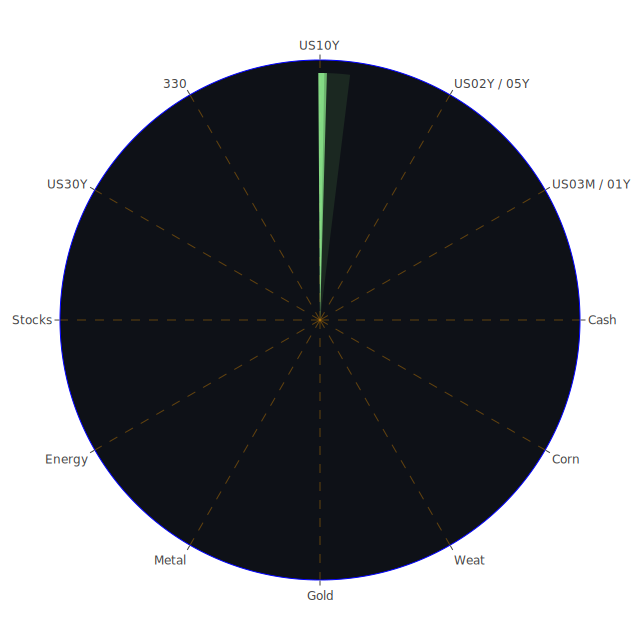

# 投資商品泡沫分析

## 美國國債
- **美國國債** 的泡沫機率在過去三天內有所波動。根據最新數據，10年期美國國債的泡沫機率從0.135440上升至0.424645，顯示市場對長期利率的擔憂增加。這可能與近期FED的鷹派言論和經濟數據顯示經濟韌性有關。

## 加密貨幣
- **比特幣（BTCUSD）** 的泡沫機率在過去三天內保持在高位，從0.864380略微下降至0.863617。儘管有些微下降，但依然處於高風險區域。近期的新聞顯示市場對加密貨幣的信心有所減弱，建議投資者謹慎操作。
- **以太坊（ETHUSD）** 的泡沫機率也持續高企，從0.955885上升至0.938753。市場對於以太坊的需求依然強勁，但高風險依然存在。

## 美國科技股
- **納斯達克指數（NDX）** 的泡沫機率在過去三天內保持在高位，從0.932427略微上升至0.940882。這反映了市場對科技股的高期望，但也顯示出潛在的風險。

## 金/銀/銅
- **黃金（XAUUSD）** 的泡沫機率在過去三天內有所上升，從0.492093上升至0.651117。這可能與市場對避險資產的需求增加有關。
- **白銀（XAGUSD）** 的泡沫機率也持續上升，從0.875580上升至0.950019，顯示市場對白銀的需求強勁。
- **銅（COPPER）** 的泡沫機率從0.127403下降至0.008205，顯示市場對銅的需求有所減弱。

## 石油/鈾期貨UX!
- **石油（USOIL）** 的泡沫機率在過去三天內保持穩定，約為0.419549。近期的新聞顯示石油市場的供需平衡較為穩定。
- **鈾期貨（UX1!）** 的泡沫機率從0.648530上升至0.704024，顯示市場對鈾的需求有所增加。

## 各國大盤指數
- **德國DAX指數（GDAXI）** 的泡沫機率在過去三天內保持在高位，從0.765291上升至0.778946。這反映了市場對歐洲經濟的信心，但也顯示出潛在的風險。
- **英國FTSE指數（FTSE）** 的泡沫機率也持續上升，從0.725677上升至0.979300，顯示市場對英國經濟的擔憂增加。

## 美國軍工股
- **洛克希德馬丁（LMT）** 的泡沫機率在過去三天內保持穩定，約為0.546994。近期的新聞顯示軍工股的需求穩定。

## 各國外匯市場
- **美元兌日元（USDJPY）** 的泡沫機率從0.752635上升至0.857273，顯示市場對日元的需求減弱。
- **歐元兌美元（EURUSD）** 的泡沫機率從0.601134上升至0.917874，顯示市場對歐元的需求增加。

## 美國電子支付股
- **PayPal（PYPL）** 的泡沫機率在過去三天內保持在高位，從0.936736上升至0.947603。這反映了市場對電子支付行業的高期望，但也顯示出潛在的風險。

## 黃豆 / 小麥 / 玉米
- **黃豆（SOYB）** 的泡沫機率從0.425503上升至0.459975，顯示市場對黃豆的需求增加。
- **玉米（CORN）** 的泡沫機率從0.630143下降至0.559812，顯示市場對玉米的需求有所減弱。

## 石油防禦股
- **埃克森美孚（XOM）** 的泡沫機率在過去三天內保持在高位，從0.825382上升至0.831532。這反映了市場對石油防禦股的高期望。

## 金礦防禦股
- **Royal Gold（RGLD）** 的泡沫機率在過去三天內保持穩定，約為0.635513。這反映了市場對金礦防禦股的需求穩定。

## 歐洲奢侈品股
- **LVMH（MC）** 的泡沫機率在過去三天內有所上升，從0.720842上升至0.854136，顯示市場對奢侈品的需求增加。

# 投資建議

## 賣出建議
- **比特幣（BTCUSD）**：由於泡沫機率高且新聞顯示市場信心減弱，建議考慮賣出。
- **以太坊（ETHUSD）**：同樣泡沫機率高，建議謹慎操作。
- **納斯達克指數（NDX）**：泡沫機率高，建議謹慎操作。
- **白銀（XAGUSD）**：泡沫機率高，建議考慮賣出。
- **德國DAX指數（GDAXI）**：泡沫機率高，建議謹慎操作。
- **英國FTSE指數（FTSE）**：泡沫機率高，建議考慮賣出。

## 買入建議
- **銅（COPPER）**：泡沫機率低且新聞顯示需求穩定，建議考慮買入。
- **黃豆（SOYB）**：泡沫機率低且需求增加，建議考慮買入。

## 觀望建議
- **美國國債**：泡沫機率在0.5左右，建議觀望。
- **黃金（XAUUSD）**：泡沫機率在0.5左右，建議觀望。
- **洛克希德馬丁（LMT）**：泡沫機率在0.5左右，建議觀望。

# 風險提示

投資有風險，市場總是充滿不確定性。我們的建議僅供參考，投資者應根據自身的風險承受能力和投資目標，做出獨立的投資決策。特別是對於泡沫機率高的商品，應該謹慎進行投資決策。
 
Daily Buy Map:

 
Daily Sell Map:

 
Daily Radar Chart:

 
