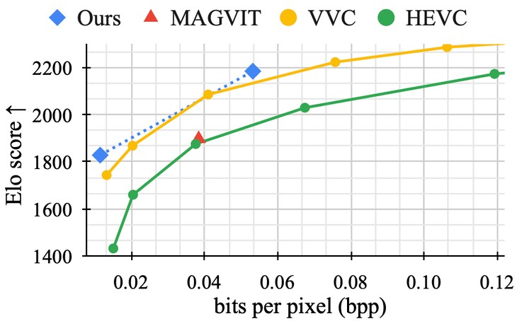

# 導言:
[GraphCast](https://deepmind.google/discover/blog/graphcast-ai-model-for-faster-and-more-accurate-global-weather-forecasting)

近日(2024/2月中) OpenAI 的 SORA引起大家廣泛的討論與注意，其底層架構來自於DiT (Diffusion Transformer)，但其實這個領域的競爭對手還不少，這次要介紹的這篇，使用Mask-LM的生成方式，可以達到最頂尖的FID/FVD分數，兼顧生成品質與生成速度，讓我們一起來看看Google與卡內基美濃大學Yu同學 (原中國北京大學高材生)團隊針對影片生成領域提出了那些SoTA見解。

生成影片技術的本質就是一種資料壓縮，把影片中的每時每刻，每張瞬間的圖片，經由模型映射成如同文字那樣的Token向量，之後就能用LM語言模型相關的技術，把類似的影片藉由Token的組合，經過反向生成 or Decode出來。神經網路能夠用很廉價的方式抽取黑格爾小邏輯裡面所提到的本質，這本質往往具有空間不變性，時間不變性，概念不變性，可以在不同的觸發條件下，像積木一樣，重新做各種排列組合以組成萬物。讓我們抱著期待的心情，看看MAGVIT架構能為我們帶來哪些驚喜應用潛能與突破。

<p align="center"></p>
<p align="center">把影片的片段映射成一維向量的Tokens，後續可以用類似生成文字查字典的方式來生成影像片段</p>

# MAGVIT令人震驚的突破:
許多人很納悶，為何傳統編解碼生成方式會不敵擴散迭代模型，MAGVIT用一系列架構設計，與後續的改良，得到能夠打敗所有擴散模型的生成結果，證明了先前的Tokenizer的Encoder Model理解影像的程度不到位，導致生成結果無法與擴散模型匹敵，於是，論文作者設計了獨特的Mask-LM流程，在改善生成結果的同時，還能多用途使用。

如下圖所示，可以做Frame Prediction (**FP**)，Frame Interpolation (**FI**，生成動畫或是遊戲補幀)；Central Outpainting (**OPC**) / Vertical Outpainting (**OPV**), Horizontal Outpainting (**OPH**), Dynamic Outpainting (**OPD**)可以用於相機防手震，影片後製；Central Inpainting (**IPC**), Dynamic In painting (**IPD**) 可以用於影片後製；Class-conditional Generation (**CG**), Class conditional Frame Prediction (**CFP**)，可以根據分鏡圖/文字Prompt來生成各種新的動畫。

<p align="center"></p>
<p align="center">有了這些工具，一個影片工作者就能搞定原本需要一整個特效/動畫團隊才能做的事情，只要能好好的Leverage這些工具，要成立一人影業/電影/動畫公司，不再是遙不可及的夢想</p>

<p align="center"></p>
<p align="center">MAGVIT一推出便驚艷世人，兼具多種生成模式彈性與達成極高的生成效率，火爆整個AI生成圈</p>

MASK-LM首先會產生一組固定的MASK框架，根據想要生成的任務(初始條件)把輸入影像填入，然後經由COMMIT Masking的步驟，一步一步將原本遮罩中的影像逐漸生成，經過多次迭代，便能完成上述所有應用目標的作業。訓練的時候，會有Scheduler來逐漸放開Mask，這種過程會被Model利用Lmask (Objective loss)學起來，這樣一來在Inference的時候就能夠自動逐步地把影像生成出來，這種手法值得我們的學習。

<p align="center"></p>

生成影像需要套用COnditional Masked Modeling by Interior Tokens (COMIT)演算法，如下所示，先針對輸入進行編碼產生z(Latent)，根據S/S*的先驗決定Mask要被替換成Conditional Token / 維持Mask / 維持Tatget Token (輸出結果)，要得到輸出結果，除了原有已經有的輸入Token以外，都要經過MASK -> Condictional Token -> Target Token的過程。temperature T參數在演算法裡面巧妙的控制Condictional Token的迭代次數，Temperature越高，能夠激發模型的創造能力，因為它會基於較多的假設來生成影像結果，總體來看，算法設計得十分巧妙。

<p align="center"></p>
<p align="center">COMMIT 算法 Pseudo-code 部分</p>

<p align="center"></p>
<p align="center">COMMIT 與傳統生成圖片 MTM生成方式比較</p>

如下圖所示，這種生成Token的方式相對於完全的Auto-regression (AR-LM)方式，比較適合用在生成影片/圖片上面，圖片比文字多了一個維度，無論照哪一種Scan的方式逐步生成，都會導致大量的Auto-Regression損失，反之，藉由學習Mask解開與生成的方式，可以讓相對比較可信的Token先浮出檯面，然後讓其他區塊參考。重點是這整個生成過程，有經過$ L_mask $和$ L_refine $ & $ L_recons $ 損失函數，共同發揮，進行調整過，整體影片生成的準確度註定會比AR-LM方式還要來得高。

<p align="center"></p>
<p align="center">ImageNet 的 Pretrain，後續主要訓練針對三個Loss同時進行收斂，確保能夠學會如何解Mask推測逐步生成</p>

# MAGVIT-V2改良部分:
* LFQ
神奇的無查找量化(Look-up Free Quantization)方法，傳統的VQGAN增加詞彙量以後生成結果反而變差，本篇作者把這些詞彙從d維(d > 0) 降到0維，化成一個整數集合，利用公式的方式來產生Output Quantized Token的每一個維度，驚奇的發現這樣可以獲得大量增加詞彙量的好處，而且還無須查找(大範圍從中找出最貼近的詞彙)。而Token的量化表達也有助於減少Token容量，表達更加泛化，也能和普通文字Token (也是離散)，混在一起使用，完成各種多模態應用在Token表達的大一統。

<p align="center"></p>

* Causal-3D CNN
作者用UCF101資料集訓練，實驗各種架構，發現Causal-3D CNN架構表現突出，Transformer對於不同3D Video Tokens之間的關係理解能力，沒有想像中得好。

* Change Downsamplers from average pooling into strided convolutions to leverage learned kernels
Down Sampling通常會先使用average or max pooling，來試驗效果(因為計算量 小)，然後嘗試用strided convolutions，看看效果能否有提升。

* 3D blur pooling (Shift invariance)
傳統會使用Augmentation方法來增加Shift invariance，本篇使用最新的3D blur pooling技術來強化CNN模型對於同樣影像，不同x/y軸位移之間的理解能力，有時間要好好理解一下，這些技術都是能否做到SoTA的細節。

* Adaptive group normalization
group normalization的改良版，放在每一級的Transformer MLP Residure sum連結之後，有時間要好好理解一下。

<p align="center"></p>
<p align="center">各種改良手法對於最終 FVD / FID / LPIPS 分數的影響</p>

# MAGVIT-V2效果評估:
無論是生成影像還是圖片，MAGVIT-v2的效果(FID / FVD / IS)都能夠登頂，顯示整體MAGVIT-v2具有一定的競爭能力。

與SORA的主幹模型DiT相比，MAGVIT-V2所呈現的優勢巨大，不確定是否在超多資料訓練以後，兩著的差距是否能縮小，抑或是DiT在SoRA上面會持續推出改進版本，能夠確定的是，Google Research / 微軟OpenAI / Meta Lecun團隊，實力相差不遠，相信在三巨頭的帶領下，AI這波將能顛覆世界以往的所有認知。

下圖的綜合比較也幫我們Update一些Mindset，單純使用GAN技術可以做到還不錯的Frame Prediction結果，但是結合MLM，可以泛化到各種應用場合，然後生成分數還比較好。Diffusion手法，相對MLM似乎越來越沒有競爭力，撇開極高的迭代次數不說，生成分數也無法達到極致，如果想要用跳步驟的方式+LCM來生成，勢必又要妥協畫質或生成多樣性，還會產生一些肉眼可見的Defect。

另外，本篇所提出來的LFQ方法，把極致再往前推了一步，相較於VQGAN，畫面的扭曲跟不自然也被消除，同時，因為不用查找與切換固定詞彙的CodeBook，有些許助益。

<p align="center"></p>
<p align="center">綜合效能比較，FID/FVD/IS分數，模型參數大小，迭代次數</p>

LFQ能夠取得相當大的進展，相對於VQGAN來說，不過作者保持開放態度，他覺得類似的方法很多，詳細需要大量的研究與實驗，才會知道怎樣的量化Methodology or Feature會有比較好的輸出分數結果，想要繼續突破的人可以往這裡研究看看。

<p align="center"></p>

MAGVIT-v2能夠Tokenize 影片，也就意味著能夠做影像壓縮，無論是參考幀跟參考幀之間的inter-Frame Prediction，還是參考幀內的 intra-Frame prediction，整個MASKVIT-v2架構都能夠勝任，在編碼端與解碼端都有MAGVIT模型的情況下，壓縮效果可以超過H.266 VVC/與H.265的HEVC，這兩種編碼方式都是現在最主流的壓縮Spec，未來應會逐漸被深度學習編解碼器 (DLCodec) 取代。

<p align="center"></p>
<p align="center">傳統以Tree structure Macro block 為單位處理，運動向量預測與像素方向預測還有DCT殘差編碼的方式，遇到了非常強大的深度學習競爭對手</p>

# 心得感想:
我們所處的宇宙本身就是一個無窮的訊息源，如今人類已經有辦法任意產生所有的影像 (相當於高維複雜宇宙的一個投影)，也就意味著我們用一些方法，能夠抽取到這個宇宙的表象中深層次的空間/時間一致性特徵。從影像壓縮這個傳統需要各種演算法的Task能被深度學習取代，能夠知道，隨著我們對於數據的理解與質量的累積，最終勢必能訓練出一個核心，能夠像宇宙一樣，不斷的生萬物，生生不息的進行迭代下去。

[Lijun Yu](https://me.lj-y.com/) MAGVIT論文的作者​，感謝其對於MASK-LM在影片生成不分的COMMIT架構設計，巧妙且精采絕倫，可以看到論文裡面巧妙地從各種SoTA方法擷取經驗，不斷改良自身的Model，更有從一些Foundamental的問題思考出發，並且做出來的改良嘗試，如LFQ，跳脫原本VQGAN的詞彙本Codebook框架，大膽嘗試了What-if，總結起來，才能有我們看到的貢獻，未來有時間，應該要整理一下所有影片生成技術的大盤狀況，這樣能夠更清楚理解整個影音生成/壓縮產業的技術發展脈絡，有助於鋪墊未來關於各種生成模型應用與改進相關的思路。

# 開源程式:
[magvit2-pytorch](https://github.com/lucidrains/magvit2-pytorch)

# 相關論文:
[Language Model Beats Diffusion -- Tokenizer is Key to Visual Generation](https://arxiv.org/abs/2310.05737)

[MAGVIT: Masked Generative Video Transformer](https://arxiv.org/abs/2212.05199)

# 引用:
```markdown
@misc{yu2023language,
      title={Language Model Beats Diffusion -- Tokenizer is Key to Visual Generation}, 
      author={Lijun Yu and José Lezama and Nitesh B. Gundavarapu and Luca Versari and Kihyuk Sohn and David Minnen and Yong Cheng and Agrim Gupta and Xiuye Gu and Alexander G. Hauptmann and Boqing Gong and Ming-Hsuan Yang and Irfan Essa and David A. Ross and Lu Jiang},
      year={2023},
      eprint={2310.05737},
      archivePrefix={arXiv},
      primaryClass={cs.CV}
}

@misc{yu2023magvit,
      title={MAGVIT: Masked Generative Video Transformer}, 
      author={Lijun Yu and Yong Cheng and Kihyuk Sohn and José Lezama and Han Zhang and Huiwen Chang and Alexander G. Hauptmann and Ming-Hsuan Yang and Yuan Hao and Irfan Essa and Lu Jiang},
      year={2023},
      eprint={2212.05199},
      archivePrefix={arXiv},
      primaryClass={cs.CV}
}
```