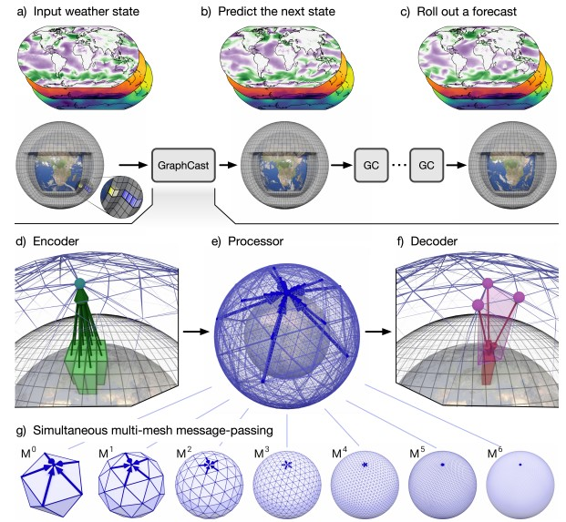
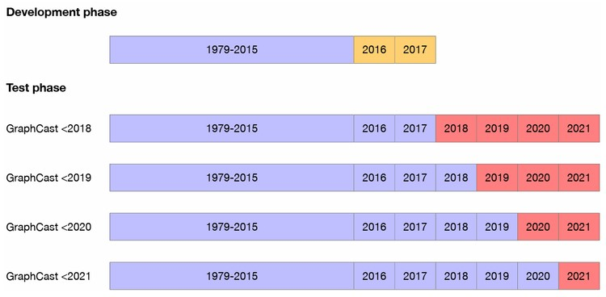

# 導言:
[Deepmind Page](https://deepmind.google/discover/blog/graphcast-ai-model-for-faster-and-more-accurate-global-weather-forecasting/)

在三國演義中，赤壁之戰，諸葛亮憑藉對湖陸風向的預測，火燒連環船，使得孫劉聯軍得以大敗曹操，奠定三國鼎立的基礎。由此可見，對於天氣的精密掌握，不僅得以改善各種生存條件，還能藉此訂定各種軍事策略，對於各種地緣政治紛爭的此刻，有其重大意義，於是各國對於快速準確的天氣預測技術，皆十分有興趣。

Google Research於2023年11月，在自然(Nature)雜誌上，發表了能夠快速且準確預測全球天氣的人工智慧模型，採用自回歸(self-Regression)，如同GPT那樣進行逐步推演，可以預測到10天後，比歐洲中期天氣預報中心(ECMWF)用超級計算機計算的高解析HRES方法，預測的還要準確。預測的項目包含溫度，風速，壓力，濕度，等等。開源程式碼用python Jax 寫成，Jax套件由Google開發，可對神經網路運算進行加速優化。

<p align="center"><iframe width="100%" height="315" src="https://www.youtube.com/embed/Q6fOlW-Y_Ss" frameborder="0" allow="accelerometer; autoplay; clipboard-write; encrypted-media; gyroscope; picture-in-picture" allowfullscreen></iframe></p>

# 論文主要架構:
使用Graph Neuron Network，如下圖所示，每一個Mesh point的Embedding，皆由鄰近的地理天氣數據經過MLP(Multiple Layer Perceptron)編碼產生，此過程被論文稱為Grid-to-Mesh。緊接著，使用MLP採樣如下圖所示M0~M6的Mesh points產生更進一步的Embeddings，此過程被論文稱為Mesh-to-Mesh。最後解回來僅參考鄰近的三個Mesh，輸入皆為上一步產生的，更進一步的Embeddings，經由MLP傳導至輸出，此過程被論文稱為Mesh-to-Grid，這裡的構造設計充分利用資料的**空間相關性**。

<p align="center"></p>
<figcaption>自回歸的方式逐步預測全球天氣，利用Grid-Mesh-Grid的資料結構準換，搭建MLP神經網路，用於準確預測全球天氣</figcaption>

在**時間相關性**部分，GraphCast使用相鄰的一個時間來推斷，輸入總共是兩筆時間的Data，後續的預測輸入拿先前的輸出結果來做預測，這就是俗稱自回歸的過程，也是目前GPT文字接龍使用的方式，作者發現取鄰近兩個時間的資料，效果比單一時間還好，取兩個以上的部分，效果並沒有改善很多，相比於Memory使用量的開銷來說。

<p align="center"></p>

Loss方面使用Mean square error，針對所有10天內自回歸在不同地點與高度的預測結果進行平均，然後再取Batch做平均。每個Grid點，在不同時間為起點的預測都有Loss，經過不斷地倒傳遞收斂，能夠取得絕佳的預測結果。

<p align="center"></p>

# 氣象資料集簡介:
資料來源是歐洲中期天氣預報中心(ECMWF)，創立於1975年，是一個國際組織，位於英格蘭。ECMWF 的 ERA5資料集，擁有從1959年到現在的天氣數據集，地理解析度為0.25。經度與緯度，約28x28 km2，每個位置擁有上百組(5+6 x 37)資料，以每個小時的時間解析度呈現。本篇論文保留原數據集的地理解析度，取如下圖所示的資料，並且將時間取樣率改成6小時，用以加速整個訓練與評估過程。

<p align="center"></p>
<figcaption>氣壓(Pressure Levels)與高度(z)有關，所以除了表面的數據5組數據以外，空中的數據有6 x 37組</figcaption>

# 論文結果評估:
從絕對RMSE誤差以及ACC (Correlation score)來看，約在推論3.5天以後和HRES(原有的可解析手法)，Graphcast才會開始拉開距離，但是從RMSE的誤差比例來看，所有推論時間段皆比原本的HRES好。在表面推論與高空推論中(表面氣壓高，高空氣壓低)，只有在極度高空(50hPa)，推論結果會輸給HRES，其他從表面到100hPa皆取得優勝。

<p align="center"></p>

GraphCast的Error均值，在不同Lead Time皆好於HRES，但是推論的Variation相當，隨著推論時間的增加，Error的範圍會逐漸擴大，有少比例的推論和原本的HRES是差不多的，對於極端溫度的推論方面，在同樣的Recall Rate下，除了12h的推論結果以外，Precision部分，GraphCast皆大於HRES，關於12h部分，不確定如果使用原時間取樣Data，然後使用先前大於兩筆時間輸入，會不會有比較好的準確率?

<p align="center"></p>

下圖表明，當訓練資料集越多，能夠取得的RMSE誤差越小，相比於原有的HRES方法，則無法經由Data的累積，不斷精進。

<p align="center"></p>
<p align="center"></p>

除了上述以外，論文內還有大量關於評估氣象預測準確度的各種Metric公式，有興趣的朋友可以看看論文的附錄部分，十分精彩。

# 心得感想:
諸如此類，基於海量資料的神經網路天氣預測方法，可以達到相較於傳統建立公式，用超級計算機計算，難以企及的精準度，與計算效率，並且可以不斷地提高準確率，只要Data夠多，這確實是一個很傑出的嘗試。不過此種方法仍然無法完全取代傳統方法，在於以下兩點:

採用自回歸方式來預測會有機率出現意料外的幻覺錯誤，突發的出現在預測之中。
神經網路比較低的可解釋程度，如果能夠有方法提前確認預測結果會很好，如果預測方向失準，在預測的時候難以察覺錯誤，也無法解釋它。
感覺神經網路的預測方式，可以和傳統超級計算機的預測方法，同時運作，相輔相成，可解釋性和準確度在現階段仍需要做取捨 (Trade-off)。

# 論文原始碼:
[Github Page](https://github.com/google-deepmind/graphcast)

# 引用:
```markdown
@misc{lam2023graphcast,
      title={GraphCast: Learning skillful medium-range global weather forecasting}, 
      author={Remi Lam and Alvaro Sanchez-Gonzalez and Matthew Willson and Peter Wirnsberger and Meire Fortunato and Ferran Alet and Suman Ravuri and Timo Ewalds and Zach Eaton-Rosen and Weihua Hu and Alexander Merose and Stephan Hoyer and George Holland and Oriol Vinyals and Jacklynn Stott and Alexander Pritzel and Shakir Mohamed and Peter Battaglia},
      year={2023},
      eprint={2212.12794},
      archivePrefix={arXiv},
      primaryClass={cs.LG}
}
```